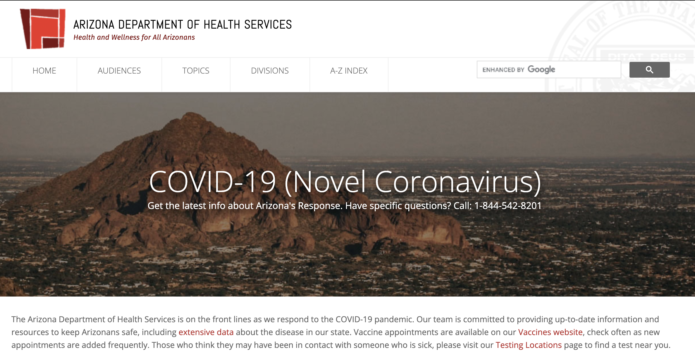
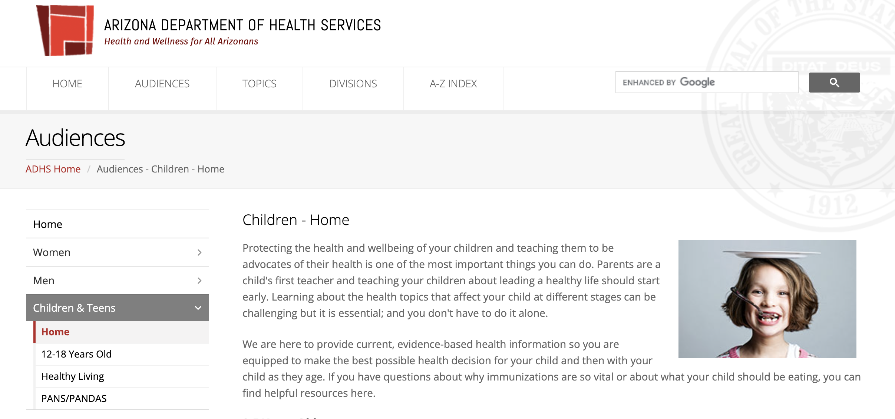

### Heuristic Evaluation of Arizona's Department of Health .gov webpages
#### Research and Documentation by Amanda Johnson
---

# Access & Care: Addressing Health Disparities Through Functional and Accessible Webpages

The COVID-19 pandemic will long present as one of the bleakest times in American history reaching almost 400,000 deaths from the virus alone as we pass the year mark of the declaration of a global pandemic (Centers for Disease Control and Prevention, 2021). As the pandemic continues to pose extraordinary threats to human development and fundamental disruptions to healthcare services, understanding our role and the change we can bring as innovators and developers is more important than ever. The effects for children, especially those with healthcare needs have been even more stark, with this period resulting in lack of access to needed resources and support they would often receive. Therefore, I chose to explore the Arizona's Healthcare .gov webpages as a means to identify these potential gaps and barriers to accessing the care and support they may need. 

Jakob Neilson's [10 Usability Heuristics Explained](https://www.nngroup.com/articles/ten-usability-heuristics/)

| # |  Usability Heuristics | 
| ------------------------|--------------------------|
| 1 |**Visibilty of System Status**: The design should allow users to feel informed with feedback and support options/availability | 
| 2 |**Match between System & Real World**: Design systems and pages based on familiar ideas and concepts to provide some intuitive knowledge for the user |
| 3 | **User Control & Freedom**: The system should allow for users to perform actions freely without consequence. There should be a "go back" or out option easily available | 
| 4 | **Consistency & Standards**: Users should not have to wonder whether different words, contexts, or actions mean the same thing. These should meet industry standards that are expected by the user  | 
| 5 | **Error Prevention**: Provide enough clarity on the webpage so users are not questioning their actions and whether these actions will result in an error. Have an available check embedded for them and present users with a confirmation option before they commit to an action (if this cannot be prevented in the first place).  | 
| 6 | **Recognition Rather than Recall**: Minimize the user's memory load by making elements, actions, and options visible. The user should not have to remember information from one part of the interface to another. Information required to use the design (e.g. field labels or menu items) should be visible or easily retrievable when needed. |
| 7 | **Flexibility & Efficiency of Use**: The design should be easier to use for all the user groups. | 
| 8 | **Aesthetic & Minimalist Design**: Grab users attention towards the action need to be done there. |
| 9 | **Help Users Recognize, Diagnose, & Recover from Errors**: Error messages should be clear and easy to understand and intrepret (wihtout code), while explaining the issue and the solution to move forward. |
| 10 | **Help & Documentation**: Ideally, the user is able to intuitively explore the site through past experience and clear directions (without explanation), however, it may be beneficial to provide documentment for users that may be unsure.  | 

Severity Rating: Severity of Usability Problems
| ------------------------ | 
| 1 = Cosmetic Problem Only | 
| 2 = Minor Usability Problem | 
| 3 = Major Usability Problem | 
Credit: [NN Group](https://www.nngroup.com/articles/how-to-rate-the-severity-of-usability-problems/)

---

## Webpage 1/2 [Arizona Department of Health Services](https://www.azdhs.gov/)
### *Health and Wellness for All Arizonans* 

The Arizona Department of Health Services (ADHS) is a state funded agency that provides health services to the State's population. The image below shows the homepage of the ADHS is dedicated to providing up to date information and resources to ensure the health and safety of the people of Arizona. With the current climate of the United States, this homepage focuses on the novel COVID-19 pandemic, and primarily focuses on access to resources and guidance related to the pandemic. 

### Evaluation
**Overall,** at first glance the website appears functional and updated. There seems to be an overall color scheme, most of the text is readable, there appears to be search bars and a support system for direct feedback. However, upon further evaluation (or just moving the cursor ever so slightly), some problematic concerns arise. For example, in the full screen view of the homepage the toolbar disappears and the visual design are particularly concerning as they hinder the user's ability to navigate to any webpages beyond COVID-19 information. 

| Rating |  Evaluation | 
| ------------------------|--------------------------|
| 2 | *Visibilty of System Status*   **Good**: The webpage has a clear search bar to help you navigate to specific areas within as well as a feedback and support button readily available for users.   **Bad**: Immediately on the homepage you are presented with information regarding 'COVID-19' however, it is not clear how to navigate the webpage other pages within, information or resources. Further, when your cursor goes over the toolbar the website starts to glitch and makes it nearly impossible to click on important content  | 
| 3 | *Match between System & Real World*  **Good**: Terminology and language seems appropriate for the context. The webpage also discusses relevant topics.   **Bad**: The list of dates on the events for the week and calendar feature are not accurate, meaning a lot of misinformation about current events is being shared. Furthermore, the functionality of the maps are unclear as well as unrealistic |
| 3 | *User Control & Freedom*   **Good**: For the most part the back button seems functional   **Bad**: There are a few areas where it is difficult to get back to the original page you started on as well as some broken links which do not allow you to return back. | 
| 2 | *Consistency & Standards*   **Good**: The red text indicates a hyperlink and is different from original text body   **Bad**: Not a lot of consistency, each page looks different from the last besides the toolbar and color scheme. There are quite a few sections that are missing that I would normally expect of a website of this caliber. | 
| 1 | *Error Prevention*   **Good**: There is little opportunity for the user to have an error in saving or submitting, little risk associated.   **Bad**: With the glitch that comes with hoovering the cursor over the navigation toolbar, users may click the wrong link then experience a difficult time navigating back to the previous page. | 
| 2 | *Recognition Rather than Recall*   **Good**: Each page has a title or header which allows users to remember what specific page they are on   **Bad**: Unclear which sites you've already navigated to, how you ended up at the specific page (the steps and clicks made by the user) and which terms have been searched. There are multiple ways to get to each page which would be difficult for the user to navigate. | 
| 2 | *Flexibility & Efficiency of Use*   **Good**: The google searchbar at the top of the homepage allows users to immediate search for their page rather than having to navigate the site.     **Bad**: Advanced options and overall website capabilities are extremely unclear. | 
| 3 | *Aesthetic & Minimalist Design*   **Good**: Cohesive color scheme    **Bad**: Inconsistent text sizes, too much or too little text throughout each page (especially the homepage). The photos have text over them which is difficult to read. There is a lot going on, especially with the amount of links and the various maps that seem to take over the whole page. | 
| 3 | *Help Users Recognize, Diagnose, & Recover from Errors*   **Good**: Error messages appear, for example, "this pathway is broken"   **Bad**: The error messages do not bring the users back to the previous page or allow for many additional options which leaves users to have to navigate to the mainpage again and lose any and all progress | 
| 3 | *Help & Documentation*   **Good**: There is an available 'Feedback & Support button'    **Bad**: Upon clicking on this button the users are directed to a pop-up which only contains information regarding feedback. This feature seems extremely outdated and unusable | 

## Webpage 2/2 [Arizona Department of Health Services (ADHS)](https://www.azdhs.gov/audiences/index.php#children-home)
### *Children Resources*

The Arizona Department of Health Services (ADHS) subsection, Children, focuses on providing parents with resources and information regarding their children. The ADHS states "protecting the health and wellbeing of your children and teaching them to be advocates of their health is one of the most important things you can do." Therefore, the purpose of this webpage is to empower parents to be the best resource and advocate for their children. 

### Evaluation
**Overall,** this webpage appears to be less busy than the homepage we were previously on. However, there is seemingly a lot of missing information. For example, there seems to be only information for children 0-11 which forces users to navigate a different page to find information on 12-18 year olds. This page may be more difficult to navigate than the previous one as the choices are not clear and there is a variety of links (most of which do not properly function).

| Rating |  Evaluation | 
| ------------------------| --------------------------|
| 2 | *Visibilty of System Status*   **Good**: There is a progress bar which is meant to show the user where they are in the site. Pages seem to move quickly and it seems apparent the status of the page   **Bad**: There is no visible loading bar when clicking on links or downloading additional files. | 
| 3 | *Match between System & Real World*   **Good**: There does seem to be a relatable photo of a child, which is the subsection of this webpage.   **Bad**: There is only one photo available and it doesn't relate much to children as a whole. There isn't additional text to explain the photo. There is also a lot of missing information as the webpage only has information for 0-11, to find information on 12-18 you must navigate to a different weboage.|
| 1 | *User Control & Freedom*   **Good**: There is seemingly a lot of control throughout the webpage.   **Bad**: There isn't an undo button or any way to confirm you submission. | 
| 2 | *Consistency & Standards*   **Good**: Some of the toolbars and help buttons stay the same throughout. This site also utilizes icons to indicate which bar is the search bar vs. whcih bar is the email signup bar   **Bad**: There is a lot going on that is inconsistent across pages. This page is very different from the homepage so the user is forced to relearn how to navigate each page. | 
| 2 | *Error Prevention*   **Good**: The ability to go back to the previous page is available.   **Bad**: This action doesn't perform consistently. It'll on rare occassion take you back to the main page, however, it typically takes you back to the homepage without an error message or a solution. | 
| 3 | *Recognition Rather than Recall*   **Good**: The navigation toolbar stays fixes which allows users to remember the available pages to search through.   **Bad**: The text moves around a lot with each click which forces users to constantly look around and doesn't facilitate recall. Further, the webpages change styles from page to page which doesn't allow the user to recall and facilitate easier navigation of the website. | 
| 3 | *Flexibility & Efficiency of Use*   **Good**: Content is located in various areas, this doesn't help with the ease of navigation, but it does allow flexibility to get to different content faster and more efficiently.     **Bad**: The webpage is not very flexible. If there is a mistake you typically have to start back at the home page. The website is not the most intuitive and forces users to make decisions they are not very sure about. | 
| 2 | *Aesthetic & Minimalist Design*   **Good:** There is seemingly more consistency with the color scheme and aesthetics.   **Bad**: Not very visially appealing. Still a lot of text on the pages and portions of the text are fairly unreadable with the color and contrast decisions. | 
| 2 | *Help Users Recognize, Diagnose, & Recover from Errors*   **Good**: Error messages appear, for example, "this pathway is broken"   **Bad**: The error messages do not bring the users back to the previous page or allow for many additional options which leaves users to have to navigate to the mainpage again and lose any and all progress | 
| 3 | *Help & Documentation*   **Good**: There is an available 'Feedback & Support button.'    **Bad**: Upon clicking on this button the users are directed to a pop-up which only contains information regarding feedback. This feature seems extremely outdated and unusable. Additionally, there is a statement that says "any documents downloaded from this webpage are unofficial and not binding on this state or political subdivision of this state" which doesn't bolster confidence in user. | 
